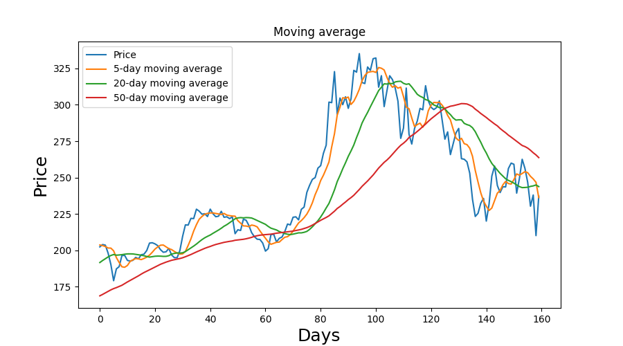
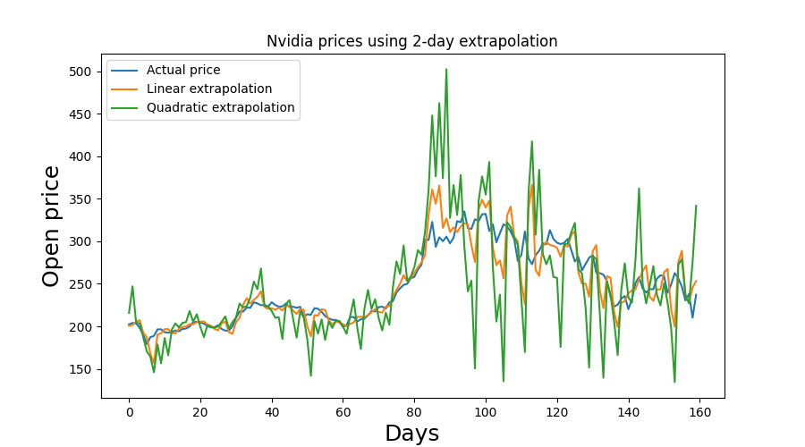

# Stock price prediction

## Introduction

The aim of this project is to use deep learning to predict future prices of stocks. The repository is constantly evolving, as I try out various different approaches, and technologies. I am creating multiple models for different stocks, and indexes. Predictions will be made for individual shares, as well as utilizing multiple datasets to give more accurate price forecasts.

### Technologies

- Recurrent Neural Networks: Long Short Term Memory, Echo State Network
- Python 3.10
- Tensorflow 2.8

## Datasets

The main dataset for this project consists of Nvidia stock prices between January 2015 and February 2022. It contains the opening prices for ~1800 trading days. The minimum value in the data stream is 4.81 while the maximum is 335.17.

For a more complex model, the prices of QQQ (US-based tech index) will be used in addition to the previously mentioned Nvidia prices.

Source: The datasets are publicly available at MarketWatch in a downloadable .csv format in yearly chanks. 

## Classic approach

### Moving average

Moving average was used in order to better understand the data, in particular the short- and long-term movements of the underlying asset. It can also be used to aid the deep learning model by utilizing the idea of mean-reversion.

### Extrapolation

Given the fact that predicting stock prices for the next n days ahead is the same as trying to figure out the next n elements in a data stream, extrapolation can be a usefull tool for it. In this case, I used it to predict the prices for the next 2 days from the previous ~1600 data points (sliding window). Linear and quadratic extrapolation was conducted.

## Deep learning models

### Basic LSTM model

Simple LSTM-based model to predict the prices of Nvidia stocks.

The input data is divided to training and testing sets with a 9:1 ratio, meaning that the first 1620 data points became the training while the remaining 180 points the test set. In order to make the job of the model a bit easier, MinMaxScaling was used to move the training values between 0 and 1.

For both the training and testing, short sequences of data were created with a length of 20 by using the sliding window approach. Essentially this means, that the stock price on the next day will be determined based on the previous 20 days of data.

The structure of the model:

- Input: sequnce of stock price data
- Hidden layers: multiple LSTM, and Dropout layers
- Output: predicted stock price for the next day

Performance on the test dataset:

As it can be seen on the performance chart, the output isn't that far of from the real figures. It actually manages to avoid naiv predictions which is just simply repeating the last element of the input sequence.

Based on the regression and performance chart, the model is giving reasonable but not accurate predictions.

Mean Absolute Error on test set: 0.09

### ESN model

A relatively new approach to predicting stock prices is the use of Echo State Networks (ESN). These are a form of reservoir computing that utilizes RNNs with a sparsely connected hidden layer. It works particularly well when there is a great amount of noise in the input data.

For this model, the pyESN Echo State Network framework was used: https://github.com/cknd/pyESN

Performance on the test dataset:

The model clearly gives more accurate predictions for the shorter term. For more than 5 days ahead, it starts to become unreliable, and oscillation quickly goes out of control if the forecase length is greater than 10.

## Plans for the future

- Add new LSTM model with Nvidia and QQQ as inputs, and Nvidia prediction as output
- Compare the results of each model and determine the best
- Use it in real trading (maybe not the best idea)

## Author

Mark Barsi