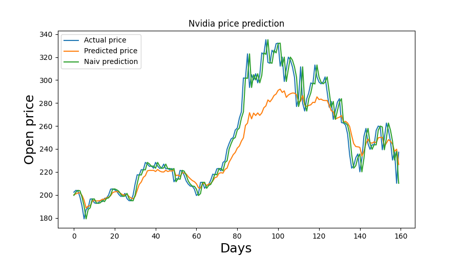
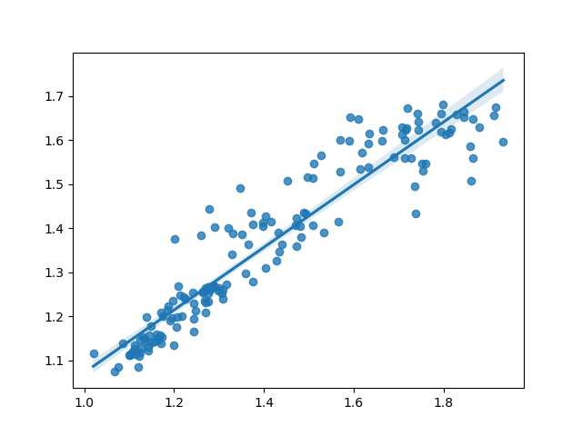
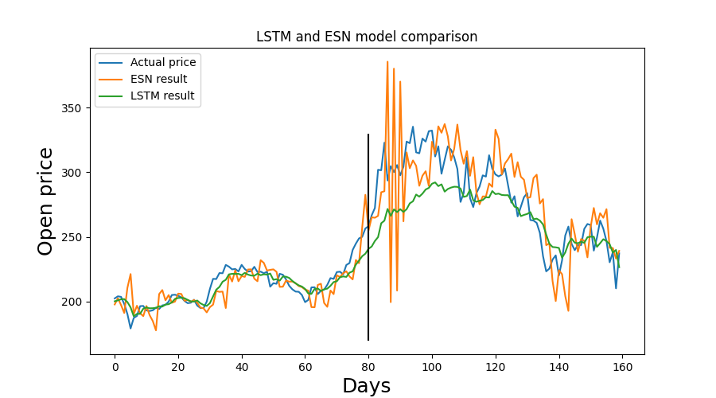

# Stock price prediction

## Introduction

The aim of this project is to use deep learning to predict future prices of stocks. The repository is constantly evolving, as I try out various different approaches, and technologies. I am creating multiple models for different stocks, and indexes. Predictions will be made for individual shares, as well as utilizing multiple datasets to give more accurate price forecasts.

### Technologies

- Recurrent Neural Networks: Long Short Term Memory, Echo State Network
- Python 3.10
- Tensorflow 2.8

## Datasets

The main dataset for this project consists of Nvidia stock prices between January 2015 and February 2022. It contains the opening prices for ~1800 trading days. The minimum value in the data stream is 4.81 while the maximum is 335.17.

For a more complex model, the prices of QQQ (US-based tech index) will be used in addition to the previously mentioned Nvidia prices.

Source: The datasets are publicly available at MarketWatch in a downloadable .csv format in yearly chanks. 

## Classic approach

### Moving average

Moving average was used in order to better understand the data, in particular the short- and long-term movements of the underlying asset. It can also be used to aid the deep learning model by utilizing the idea of mean-reversion.

### Extrapolation

Given the fact that predicting stock prices for the next n days ahead is the same as trying to figure out the next n elements in a data stream, extrapolation can be a usefull tool for it. In this case, I used it to predict the prices for the next 2 days from the previous ~1600 data points (sliding window). Linear and quadratic extrapolation was conducted.

## Deep learning models

### Basic LSTM model

Simple LSTM-based model to predict the prices of Nvidia stocks.

The input data is divided to training and testing sets with a 9:1 ratio, meaning that the first 1620 data points became the training while the remaining 180 points the test set. In order to make the job of the model a bit easier, MinMaxScaling was used to move the training values between 0 and 1.

For both the training and testing, short sequences of data were created with a length of 20 by using the sliding window approach. Essentially this means, that the stock price on the next day will be determined based on the previous 20 days of data.

The structure of the model:

- Input: sequnce of stock price data
- Hidden layers: multiple LSTM and Dropout layers
- Output: predicted stock price for the next day

Performance on the test dataset:

As it can be seen on the performance chart, the output isn't that far of from the real figures. It actually manages to avoid naiv predictions which is just simply repeating the last element of the input sequence.

Based on the regression and performance chart, the model is giving reasonable but not accurate predictions.

Mean Absolute Error on test set: 0.09

### Complex LSTM model

Complex LSTM model to predict Nvidia prices based on previous Nvidia and QQQ price sequences.

The input data is very similar to the one used in the previous model. Training and testing ratio is 9:1, MinMaxScaling was used to transfer them between 0 and 1, and the sequence length was 20. The main difference is that each and every data sequence is 2D where the first dimension is the Nvidia and the second is the QQQ prices.

The structure of the model:

- Input: 2D stock price sequence
- Hidden layers: multiple LSTM and Dropout layers
- Output: predicted stock preice for the very next day

Performance on the test dataset:

It can be seen that this model gives similar results to the Simple LSTM model. Even though the model manages to avoid naiv prediction, it is still not accurate. 

Mean Absolute Error on test set: 0.07

### ESN model

A relatively new approach to predicting stock prices is the use of Echo State Networks (ESN). These are a form of reservoir computing that utilizes RNNs with a sparsely connected hidden layer. It works particularly well when there is a great amount of noise in the input data.

For this model, the pyESN Echo State Network framework was used: https://github.com/cknd/pyESN

Performance on the test dataset:

The model clearly gives more accurate predictions for the shorter term. For more than 5 days ahead, it starts to become unreliable, and oscillation quickly goes out of control if the forecase length is greater than 10.

Mean Absolute Error for 2 days: 0.09

Mean Absolute Error for 5 days: 0.13

## Model comparison

### Connection between Nvidia and QQQ prices

|    Metrics    | Nvidia prices | QQQ prices    |
| ------------- |:-------------:|:-------------:|
| Minimum       | 4.81          | 94.23         |
| Maximum       | 335.17        | 405.57        |
| Mean          | 68.8194       | 192.4404      |
| Std deviation | 70.3984       | 86.0612       |

The correlation between Nvidia and QQQ is 0.9575 which is not surprising considering the fact that QQQ is a technology index which contains Nvidia among its 100 companies. This correlation may have an impact on the result of the complex model.

### Basic and Complex LSTM models

Based on this comparison chart, it can be said, that the complex model is almost always more accurate than the simple one. In fact, it is true in general that the more factors you use to determine the price of a stock, the better the results are going to be. It was excepted purely based on the Mean Absolute Error metric which in the case of the complex model was 0.07 as opposed to the 0.09 of the base model.

Both results are more or less the same up until Day 80. I would attribute it to the rapidly increasing volutility of the asset starting somewhere around Day 70. In the first half of the prediction cycle, linear extrapolation is fairly close to the actual prices however, it is way off from Day 80. This observation was further exaggerated by quadratic extrapolation.

| Model   | First half | Second half |
| ------- |:----------:|:-----------:|
| Basic   | 0.04       | 0.15        |
| Complex | 0.03       | 0.11        |

This comparison of MAE on the first and second parts also proves this.

### LSTM and ESN models

The same separation line at Day 80 can be seen in this chart as well. This gives us further proof that this is happening due to volutility, simply because of the nature of ESN models.

| Model   | First half | Second half |
| ------- |:----------:|:-----------:|
| LSTM    | 0.03       | 0.11        |
| ESN     | 0.05       | 0.14        |

The comparison of MAE also indicates this difference in accuracy.

The two areas where the ESN model clearly outshines both of my LSTM models are training time, and having the ability to give somewhat accurate predictions for multiple days ahead in the future.

## Ways to improve the models

Even though I have spent a considerable amount of time on the models, they are by no means perfect. Here are a few ways which might help with accuracy:

- Longer training sequence
- Using other metrics such as moving average, volutility, and other stocks or indexes in tandem with previous prices

## Author

Mark Barsi