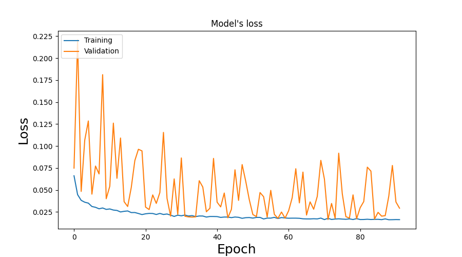
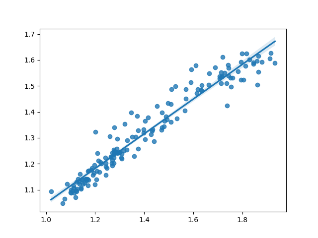

# Stock price prediction

## Introduction

The aim of this project is to use deep learning to predict future prices of stocks. The repository is constantly evolving, as I try out various different approaches, and technologies. I am creating multiple models for different stocks, and indexes. Predictions will be made for individual shares, as well as utilizing multiple datasets to give more accurate price forecasts.

### Technologies

- Recurrent Neural Networks: Long Short Term Memory, Echo State Network
- Python 3.10
- Tensorflow 2.8

## Datasets

Nvidia and QQQ (US-based tech index) stock prices between January 2015 and February 2022 are used as an example.

The datasets are publicly available at MarketWatch in a downloadable .csv format in yearly chanks. 

## Models

### Basic LSTM model

Simple LSTM-based model to predict the prices of Nvidia stocks. This model will be used as a baseline for future models.

- Input: sequnce of stock price data
- Hidden layers: multiple LSTM, and Dropout layers
- Output: predicted stock price for the next day

Performance on the test dataset:

As it can be seen on the performance chart, this model cannot be used in free running mode, meaning that the prediction only makes sense for the next day.

### ESN model

A relatively new approach to predicting stock prices is the use of Echo State Networks (ESN). These are a form of reservoir computing that utilizes RNNs with a sparsely connected hidden layer. It works particularly well when there is a great amount of uncertenty.

For this model, the pyESN Echo State Network framework was used: https://github.com/cknd/pyESN

Performance on the test dataset:

The model clearly gives more accurate predictions for the shorter term. More than 5 days ahead starts to become unreliable, and it starts to oscillate out of controll if the forecase length is greater than 10.

## Plans for the future

- Add baseline models: moving average, linear extrapolation
- Add new LSTM model with Nvidia and QQQ as inputs, and Nvidia prediction as output
- Optimize the hyperparameters of the ESN model
- Compare the results of each model and determine the best
- Use it in real trading (maybe not the best idea)

## Author

Mark Barsi